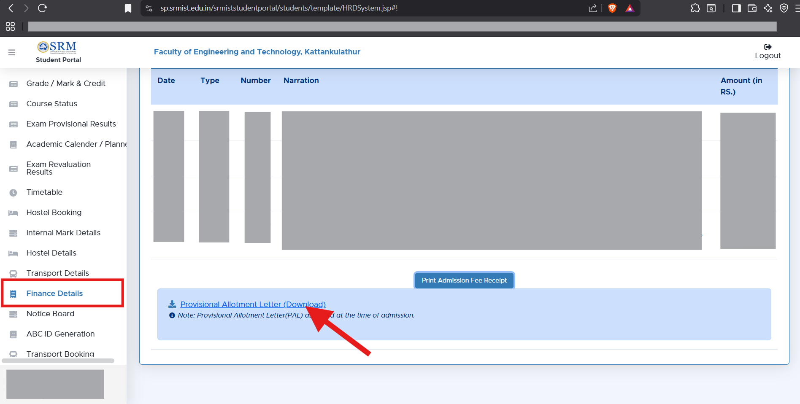
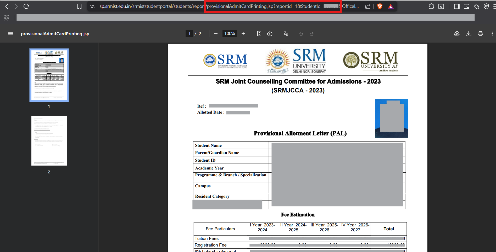
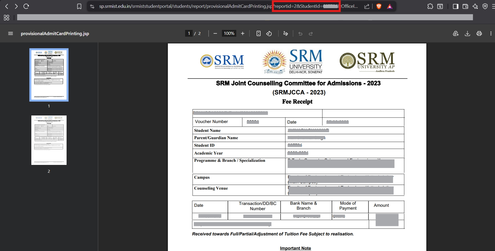
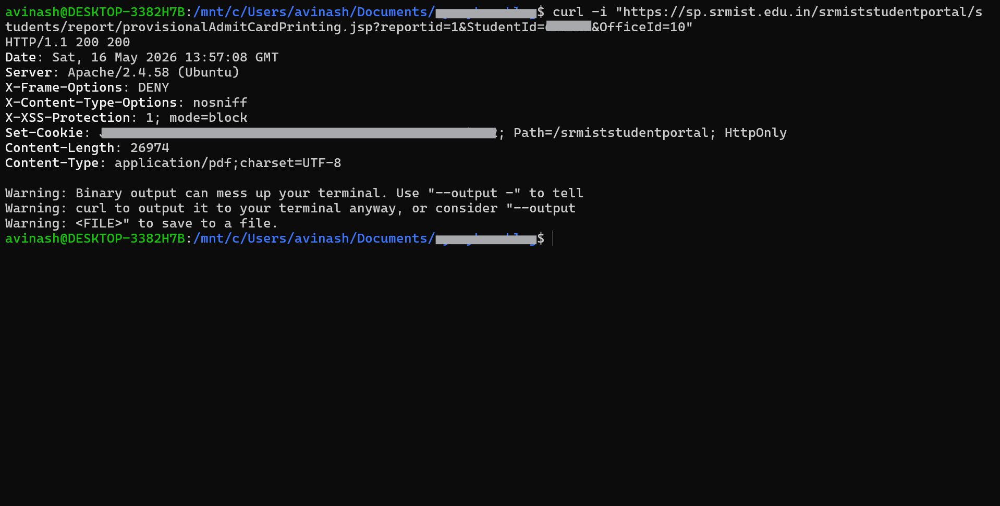
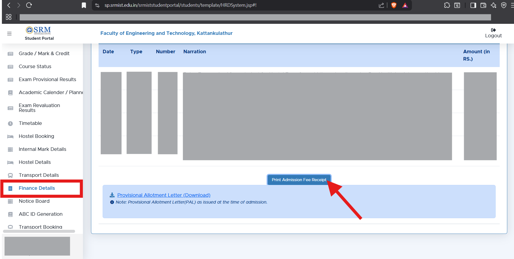
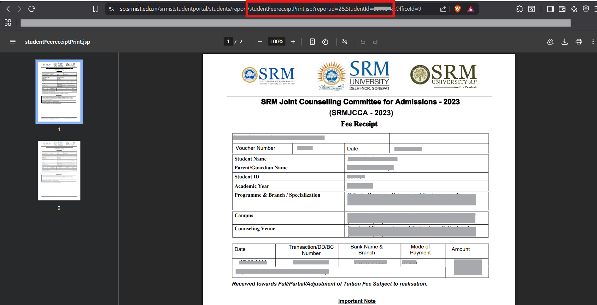

# **SRM STUDENT PORTAL - Unauthenticated IDOR / Sensitive Document Disclosure**

### **Overview**
 
Two JSP endpoints in the SRM Student Portal expose sensitive student documents through **Insecure Direct Object Reference (IDOR)**. Both endpoints return documents based on a `StudentId` URL parameter without properly verifying whether the requester is authorized to access that student's data.  
  
The two vulnerabilities differ in severity:
 
| # | Endpoint | Auth Required? | Vulnerability Type |
|---|----------|----------------|--------------------|
| 1 | `provisionalAdmitCardPrinting.jsp` | No | Unauthenticated IDOR — anyone on the internet can access any student's document |
| 2 | `studentFeereceiptPrint.jsp` | Yes | Authenticated IDOR — a logged-in student can access *other* students' documents |

---
### **Vulnerability 1 — Unauthenticated IDOR on Provisional Allotment Letter Endpoint**

**Endpoint:**
```
GET https://sp.srmist.edu.in/srmiststudentportal/students/report/provisionalAdmitCardPrinting.jsp
```
 
**How to reach this URL in the portal:**
> Student Portal → Finance Details → Provisional Allotment Letter (Download)
 


### What's Wrong
 
This endpoint returns a student's **Provisional Allotment Letter (PAL)** PDF based solely on the `StudentId` additionally if `reportid` can be changed to gives **Fee Receipts** PDF. There is **no login, session, or token check** of any kind. Anyone who knows (or guesses) a `StudentId` and changes `reportid` can download that student's documents.
 
### URL Parameters
 
| Parameter | Effect |
|-----------|--------|
| `StudentId` | **Required.** Determines whose document is returned. Changing this to any other student's ID returns their document. |
| `reportid` | **Required.** Determines which PAL document variant is returned. Changing this value returns different document versions for the same student. |
| `OfficeId` | Has no effect on access or output. Removing it entirely still returns the document. |
 
### Proof of Concept
 

This is the Provisional Allotment Letter Document, by changing the `StudentId` we can see other students PAL.  

.  

This is the Fee Receipt Document, we get this by changing the `reportid=2` for any student.  
  
.

Direct unauthenticated `curl` request successfully returned a sensitive student PDF document with HTTP 200 response, confirming the endpoint is publicly accessible without login.

The following request returns a real student's PDF document **with no cookies, no session, and no authentication headers**:
This can also be reproduced by:
- Pasting the URL into any browser (no login needed)
- Opening in a private/incognito window
- Using a completely different browser or device
- Using `curl` or any HTTP client with no session cookies
### Scope of Access
 
Changing the `StudentId` parameter returns documents belonging to arbitrary students, even if the Student:
- Belongs to a Different Departments
- Belongs to a Different Branch
- Belongs to a Different Campuses
 
### What the Documents Expose
 
- Student ID
- Student Name
- Father's Name
- Scholarship Details
- Fee Structure
- Transaction / DD / BC Number
- Bank Name & Branch
- Payment Information
### Impact
 
This is a **critical** vulnerability. Because no authentication is required, any person on the internet — with no account or prior access — can enumerate student IDs and mass-download the sensitive financial and personal documents of every student in the system.
 
---
 
### **Vulnerability 2 — Authenticated IDOR on Fee Receipt Endpoint**
 
**Endpoint:**
 
```
GET https://sp.srmist.edu.in/srmiststudentportal/students/report/studentFeereceiptPrint.jsp
```
 
**How to reach this URL in the portal:**
> Student Portal → Finance Details → Print Admission Fee Receipt
 



### What's Wrong
 
This endpoint does require a valid login session, but it does **not verify that the logged-in student owns the document they are requesting**. A student can change the `StudentId` parameter to any other student's ID and receive that student's fee receipt.
 
### URL Parameters
 
| Parameter | Effect |
|-----------|--------|
| `StudentId` | **Required.** Determines whose fee receipt is returned. A logged-in student can set this to any other student's ID to access their receipt. |
| `reportid` | Present in requests but did not expose different document types the way it does on the other endpoint. |
| `OfficeId` | Has no effect on access or output. Removing it entirely still returns the document. |
 
### Proof of Concept
 

This is the Fee Receipt Document we get, Note that it is the same document as before but this time accessed through the `studentFeereceiptPrint.jsp` endpoint.

### What the Documents Expose
 
Each fee receipt contains the same categories of sensitive data listed above (name, father's name, payment details, bank information, etc.).
 
### Impact
 
This is a **high-severity** vulnerability. Any enrolled student with a valid login can access the financial records of every other student in the system. Unlike Vulnerability 1, this requires an account — but given that every student has one, that is not a meaningful restriction.
 
---
 
### **Remediation**
 
Both vulnerabilities share the same root cause: the server returns documents based on a URL parameter without checking whether the requester is authorized. The following fixes address both:
 
1. **Enforce ownership checks server-side.** After authenticating the user's session, verify that the `StudentId` in the request matches the student associated with that session. Reject requests where they don't match.
2. **Remove unauthenticated access entirely.** The `provisionalAdmitCardPrinting.jsp` endpoint must require a valid authenticated session before returning any document. There is no legitimate reason for this endpoint to be publicly accessible.
3. **Replace sequential numeric IDs with opaque tokens.** Predictable `StudentId` values (e.g. `608423`) make enumeration trivial. Use securely generated, non-guessable tokens to reference documents in URLs.
4. **Apply authorization checks to all report-generating endpoints.** Audit every JSP endpoint that generates or serves documents and ensure each one enforces both authentication and ownership verification.
